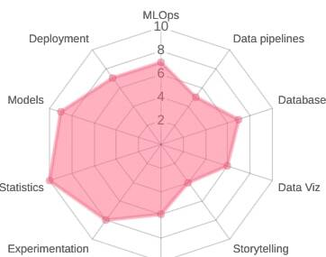

### Hello world, I'm Aymane 👋
 

I'm a Data Scientist & Machine Learning Engineer !
- You can find my public **works** **[here]**
- Passionate about **Science** 🚀, **Travel** 🛫 and **Deep Learning** 🧠

### Contact me :
[][linkedin]

 

 

### Main Languages and Tools:

 
 

---

[here]: https://github.com/AymSa?tab=repositories
[linkedin]: https://www.linkedin.com/in/aymane-saadaoui/